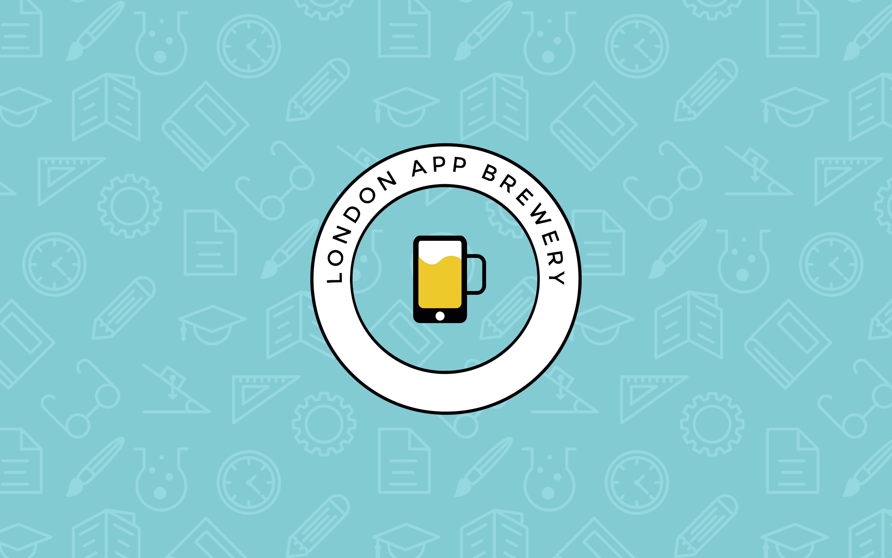

# 100 Days of Python 🐍

Code for [100 Days of Code - The Complete Python Pro Bootcamp for 2021](https://www.udemy.com/course/100-days-of-code).

## 🔰 Beginner

- [Day 1](day001-014/day001): Working with Variables in Python to Manage data
- [Day 2](day001-014/day002): Understanding Data Types and How to Manipulate Strings
- [Day 3](day001-014/day003): Control Flow and Logical Operators
- [Day 4](day001-014/day004): Randomisation and Python Lists
- [Day 5](day001-014/day005): Python Loops
- [Day 6](day001-014/day006): Python functions & Karel
- [Day 7](day001-014/day007): Hangman
- [Day 8](day001-014/day008): Function Parameters & Caesar Cipher
- [Day 9](day001-014/day009): Dictionaries, Nesting and the Secret Auction
- [Day 10](day001-014/day010): Functions with Outputs
- [Day 11](day001-014/day011): The Blackjack Capstone Project
- [Day 12](day001-014/day012): Scope & Number Guessing Game
- [Day 13](day001-014/day013): Debugging: How to Find and Fix Errors in your Code